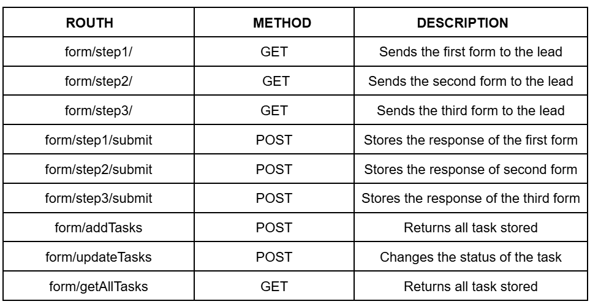

# Lobbes Automation Integation 

## 📐 Architecture 

**The Project's arquitecture has the following arquitecture :**

**Components**

**1- Lobbes CRM** 

> Creates, Tasks and Logs 
> Stores responses of different forms 
> Changes the status of different tasks

**2- N8N Workflow** 

>  Has the necsary nodes to make the worflow functional  
>  Acts as a communication bridge between the backend and the CRM.” 
>  Has the logic of all the workflow, and decides which Apis calls,

**3- Backend Service** 

>  Contains the logic of emails and forms,  
>  Stores the tasks creted in the CRM , and the responses of the forms  
>  Manages the logic of the different endpoints of each API  

**4- Forms** 

>  Contains the questions  of the form  
>  Send the responses to the backend service

## 🔄 Workflow Logic

<u>**1. Task Initialization**<u>

Tasks are created in Lobees CRM, in order to do that we must first have some leads,
We have one parent task **Send forms** and three child tasks **Send form 1**, **Send form 2**, **Send form 3**,
each task will be ligated to a form,
n8n retrieves tasks filtered by lead email, and proceed to pass this tasks to backend service
Tasks are created in Django backend, with a id 
Status is reset via API, of all tasks filtered by email, in my case is **cristianalg740@gmail.com**
Once we have created the tasks we call again backend service to get tasks by Title and email, the title for 
the first task is **Send form 1**, when we get that task we procced to change the status to **In progress** 
and we will send the first form to the lead

2. Form 1 Flow

Once the lead submmits its responses of the first form, the responses will be saved in Django and n8n will recive a Json, with the information
received, but to send the second email whith the second form,  we must first filter by **interest**, if  ** interest == yes**  we change
the status of that task to **completed**, then we call backend service to get tasks stored  in our Django project, and we filter by email which
coninues being the same  and by Title, that in this case  the Title is **Send form 2** after we get that task,   our backend will proceed to send the second form to the lead by email, and will change the status of the second Task, to ** In progress** 

3. Form 2 Flow
   
Once the lead submmits its responses of the second form, the responses will be saved in Django and n8n will recive a Json, with the information
received, but to send the third email with the third form, we must first filter by **proposed time**, if  ** proposed time  == yes**  we change
the status of that task to **completed**, then we call backend service to get tasks stored  in our Django project, and we filter by email which
coninues being the same  and by Title, that in this case  the Title is **Send form 3** after we get task,   our backend will proceed to send the third form to the lead by email, and will change the status of the second Task, to ** Completed ** 

4. Form 3 Flow
 
Once the lead submmits its responses of the second form, the responses will be saved in Django and n8n will recive a Json, with the information
received, but to send the third email with the third form, we must first filter by **proposed time**, if  ** proposed time  == yes**  we change
the status of that task to **completed**, then we call backend service to get tasks stored  in our Django project, and we filter by email which
coninues being the same  and by Title, that in this case  the Title is **Send form 3** after we get task,   our backend will proceed to send the third form to the lead by email, and will change the status of the second Task, to ** Completed ** 

## 🔗 API Endpoints 
The backend service has the following endpoints : 

## ⚡ System Execution 

**Backend Service (Django)**  

In order to make this work , first clone the project and open the backendLobbes directory in your computer 
if you haven't done it yet, 

       git clone <url-repository>
Second, create a virtual environment 

           python -m venv venv

Third,  you have to activate the  environment created

        .\venv\Scripts\activate         
           
Then, install the necesary requirements written in requirements.txt

         pip install -r requirements.txt
After that migrate to create the necesary tables in SQLite

         python manage.py migrate
         
And finally run the backend service 

         python manage.py runserver

if everything is OK, the console will show a mesage like this :
>  System check identified 2 issues (0 silenced). 
   March 26, 2026 - 15:04:43 
   Django version 6.0.1, using settings 'Forms.settings' 
   Starting development server at http://127.0.0.1:8000/ 
   Quit the server with CTRL-BREAK.  
   WARNING: This is a development server. Do not use it in a production setting. Use a production WSGI or ASGI server instead. 
   For more information on production servers see: https://docs.djangoproject.com/en/6.0/howto/deployment/ 

**Ngrok System**  
Before run this executable, we must first have installed **Ngrok** 
Open your console cmd and write the following command, 

         ngrok http 800

*In this case I used port 8000 because my Django project is running in port 8000*
*You can change the port acording to your needings*

If everything goes OK ,  in the console will appear a message similar to this : 

>  Session Status                online 
   Account                       cristianalg740@gmail.com (Plan: Free) 
   Update                        update available (version 3.37.3, Ctrl-U to update) 
   Version                       3.36.1-msix-stable 
   Region                        Europe (eu) 
   Web Interface                 http://127.0.0.1:4040 
   Forwarding                    https://pelletlike-primely-shalanda.ngrok-free.dev -> http://localhost:8000  
   Connections                   ttl     opn     rt1     rt5     p50     p90 
                                 0       0       0.00    0.00    0.00    0.00 
                                 
  Executing the previous ngrok command, we will get a temporary https url that is pubclic   and will help you to send forms and manage the logic of your backend service  
  For example : 

             Forwarding       https://pelletlike-primely-shalanda.ngrok-free.dev -> http://localhost:8000
             
*This url, starting with https replaces your localhost and your port*          
         
##  🤖  Automation

